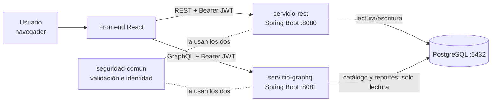
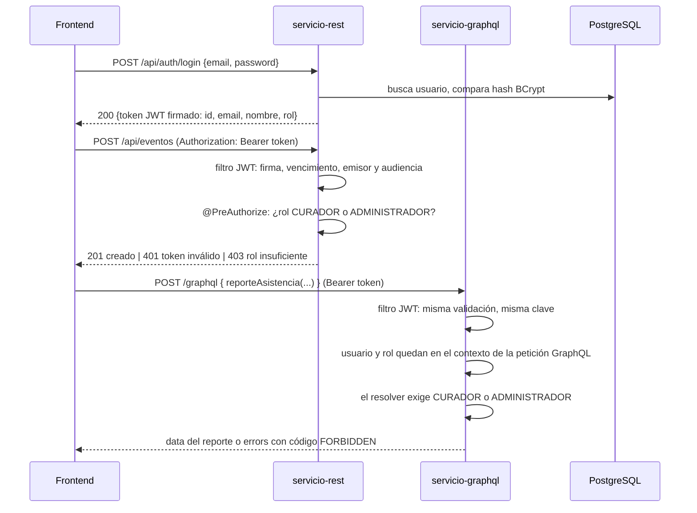
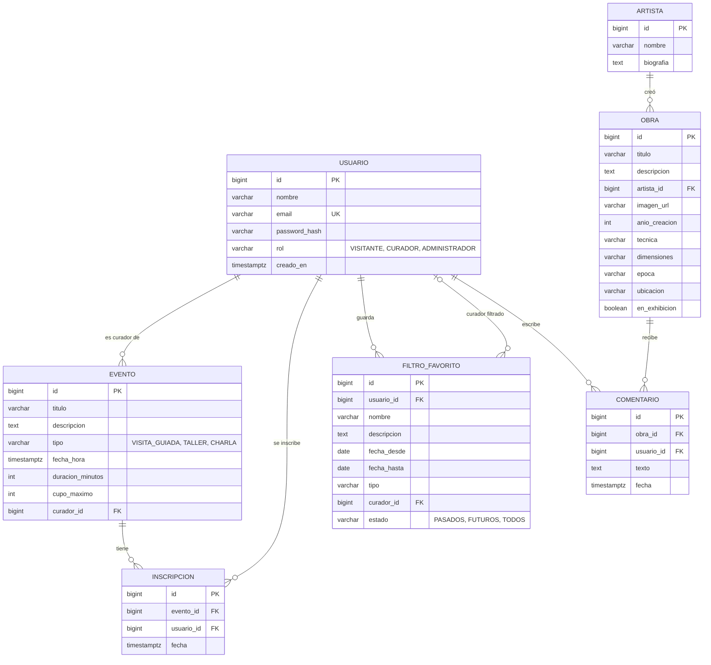

# Plan — TP Web Services: Museo Virtual Interactivo

UNLa · Desarrollo de Software en Sistemas Distribuidos · Consigna en
[`consigna.pdf`](consigna.pdf).

**Versión 3 · revisión del 19/09/2026.** Contrastada con la consigna, las
slides REST y GraphQL, la introducción a sistemas distribuidos y los capítulos
pertinentes del libro de Bazán et al. Las fuentes y los límites de la revisión
figuran en la sección 11.

**Estado real:** el repositorio contiene documentación y bibliografía; todavía
no hay aplicaciones implementadas. Los comportamientos y pruebas de este plan
son criterios de aceptación pendientes de ejecución, no resultados obtenidos.

La arquitectura del plan anterior se conserva como propuesta. Las reglas que
la consigna no define se identifican como **decisiones propuestas**: mejoran
el contrato, pero no deben presentarse como exigencias de la cátedra. Las
preguntas para el grupo están en la [sección 10](#10-preguntas-para-cerrar-entre-todos).

---

## 0. La idea en un minuto

- **Dos servidores Spring Boot** separados: uno **REST** (login, eventos,
  inscripciones, filtros favoritos, Excel) y uno **GraphQL** (catálogo de
  obras y reporte de asistencia).
- **Una sola base PostgreSQL**, levantada con Docker para que todos tengamos
  exactamente la misma.
- **JWT** para todo: el servidor REST lo emite en el login, y **los dos**
  servidores lo validan por su cuenta con Spring Security.
- **React** consume los dos servidores.
- Arrancamos definiendo los **contratos** (tablas, endpoints, schema GraphQL)
  para que cada uno pueda avanzar en paralelo sin esperar al otro.

```
React ──HTTP + JWT──▶ servicio-rest    (:8080) ──┐
      └─HTTP + JWT──▶ servicio-graphql (:8081) ──┴──SQL──▶ PostgreSQL (:5432)
```

---

### Alcance de la primera entrega

Implementar los cinco requerimientos y sus pantallas. El catálogo se carga
con datos de prueba: la consigna pide consultarlo, no administrar obras,
artistas ni publicar comentarios. No agregar esos CRUD, gestión de roles,
recuperación de contraseña ni registro de asistencia presencial al alcance
inicial. Los tres roles se preparan en los datos de prueba.

## 1. Qué pide la consigna, en limpio

| # | Requerimiento | API | Roles |
|---|---|---|---|
| 1 | Catálogo de obras con filtros opcionales y combinables, datos anidados | **GraphQL** | Visitante, Curador, Admin |
| 2 | Eventos: listar con filtros, detalle, inscribirse/desinscribirse, CRUD + filtros favoritos guardados | **REST** | Todos; el CRUD solo Curador y Admin |
| 3 | Reporte de asistencia agrupado por mes y/o tipo | **GraphQL** | Curador, Admin |
| 4 | Exportar el reporte a Excel, **una hoja por tipo de evento** | **REST** | Curador, Admin |
| 5 | `register`, `login`, `me` con JWT + control por rol en REST **y** en GraphQL | **REST** | Todos |

### Checklist de entrega — si falta cualquiera, desaprobamos

La consigna lo dice textual: *"El incumplimiento de cualquiera de las normas
de entrega implicará la desaprobación automática"*.

- [ ] Swagger / OpenAPI 3.0 de los puntos 2, 4 y 5, **con `securitySchemes`
      Bearer** (el botón *Authorize* para probar con token)
- [ ] Schema GraphQL con documentación interactiva (**GraphiQL**) de los puntos 1 y 3
- [ ] Módulos independientes
- [ ] Documento con **estrategia de resolución**
  - [ ] **Diagrama de arquitectura** que muestre el **flujo de autenticación** y
        cómo REST y GraphQL validan identidad y permisos
  - [ ] **DER**
  - [ ] **Justificación** de tecnologías y frameworks
- [ ] Código propio en **repositorio público de GitHub**
- [ ] **Video** narrado con la app funcionando: todos los módulos y cómo interactúan
- [ ] **Integrantes y qué hizo cada uno**

---

## 2. Qué nos enseña la cátedra y cómo lo usamos

### Qué aporta cada fuente y qué no demuestra

| Fuente | Aplicación al TP | Límite de la justificación |
|---|---|---|
| Consigna, pp. 2–5 | Funciones, roles, protocolos y entregables | Permite dos servidores o un proyecto modular; no obliga a usar microservicios ni Spring |
| Slides REST, láminas 4–9 y 11–20 | Recursos, verbos, solicitudes sin estado, códigos y documentación | JWT es un requisito de la consigna; REST sin estado no exige JWT ni prohíbe consultar la base |
| Slides GraphQL, láminas 5, 7 y 11–14 | Schema como contrato, selección de campos y acceso directo a datos | Reducir campos transferidos no garantiza evitar N+1 en SQL |
| Introducción a sistemas distribuidos, apartados de concurrencia, fallos y transparencia | Coordinar cupos y explicar qué ocurre cuando cae un componente | Dos procesos con una base compartida no garantizan tolerancia a fallos |
| Bazán et al., caps. 1, 4, 5 y 6 | Cliente/servidor, capas, contratos y transacciones | Son fundamentos; no una validación del diseño concreto ni de versiones actuales |

Las slides enlazan ejemplos del profesor:
[REST](https://github.com/JulianTomczak/api-rest-dssd),
[frontend REST](https://github.com/JulianTomczak/front-apirest),
[GraphQL](https://github.com/JulianTomczak/graphqlApp) y
[frontend GraphQL](https://github.com/JulianTomczak/front-graphql).
Sirven como referencias didácticas. En esta revisión no se pudo verificar su
código completo ni ejecutarlos; se retiran las afirmaciones del plan anterior
sobre versiones exactas, fallos 500 y convenciones internas no comprobadas.
No copiar componentes sin entenderlos: la entrega exige código propio.

### JSend, el formato de respuesta

Propuesta basada en la lámina 18: las respuestas JSON de negocio REST
tienen esta forma (la consigna no impone JSend):

| Caso | Forma |
|---|---|
| Todo bien | `{ "status": "success", "data": { ... } }` |
| Error del cliente (validación, sin cupo, sin permiso) | `{ "status": "fail", "data": { "campo": "motivo" } }` |
| Error del servidor | `{ "status": "error", "message": "..." }` |

Las respuestas **204 no llevan cuerpo**. La descarga exitosa del Excel devuelve
el archivo; sus errores usan JSON. OpenAPI conserva su propio formato y
GraphQL utiliza `data` y `errors`, sin envolverlos en JSend.

### Verbos y códigos HTTP, según las slides

| Operación | Verbo | Respuesta |
|---|---|---|
| Crear | `POST` | **201** Created |
| Consultar | `GET` | **200**, o **404** si no existe |
| Reemplazar | `PUT` | 200 |
| Modificar parte | `PATCH` | 200 |
| Borrar | `DELETE` | **204** No Content |
| Entrada inválida | — | **400** |
| Sin token o token inválido | — | **401** |
| Token válido pero rol insuficiente | — | **403** |
| Conflicto (sin cupo, ya inscripto, email repetido) | — | **409** |

### Justificación sin exagerar las propiedades del sistema

- **Separación de responsabilidades:** cada API tiene un proceso y contrato
  propio, pero ambas dependen del esquema compartido. No se comunican entre
  sí por HTTP en la opción propuesta; el navegador sí usa HTTP con ambas.
- **Transparencia para el usuario:** una interfaz reúne catálogo y eventos.
  El código del frontend conoce dos direcciones de API, por lo que no hay
  transparencia completa de ubicación para ese cliente (Bazán, cap. 1,
  pp. 13–14; cap. 3, apartado de transparencia).
- **Capas:** presentación, lógica y persistencia ayudan a organizar el código
  (Introducción, apartado «Sistemas N-Tiered»; Bazán, cap. 4). Esta separación
  interna no demuestra por sí sola la restricción de capas de REST.
- **Concurrencia:** el cupo requiere una transacción local y coordinación de
  escrituras (Bazán, §6.4, pp. 90–92). No hacen falta transacciones distribuidas:
  la inscripción se resuelve enteramente dentro de PostgreSQL.
- **Despliegue reproducible:** Docker facilita preparar la base. No se debe
  presentar un contenedor local como prueba de nube, replicación o alta
  disponibilidad por citar el capítulo 8.

---

## 3. Arquitectura

### Componentes



### Flujo de autenticación — el diagrama que pide la consigna



Reglas propuestas para implementar y probar:

1. REST emite el token; ambos servidores verifican firma, algoritmo permitido,
   `exp`, `iss` y `aud`, e interpretan los mismos roles. `sub` identifica al
   usuario. Usar un vencimiento configurable, inicialmente 60 minutos.
2. Mantener la clave simétrica compartida del plan para este TP, fuera del
   repositorio. **Ambos procesos podrían firmar técnicamente** por conocerla;
   que solo REST emita es una responsabilidad de la aplicación, no aislamiento
   criptográfico. No hace falta agregar otro servicio de identidad.
3. No mantener sesión HTTP. Consultar datos persistentes de un usuario no
   contradice que una petición sea sin estado. Si se cambia un rol por fuera
   de la aplicación, el token anterior conserva sus permisos hasta vencer;
   no se incluye revocación inmediata en esta entrega.
4. Reutilizar Spring Security y su identidad validada. Un interceptor agrega
   esa identidad al contexto GraphQL requerido por la consigna; nunca confiar
   en un rol enviado como argumento de la consulta ni volver a decodificar
   el token sin validación. Activar seguridad de métodos si se usan
   anotaciones de autorización. [Seguridad de Spring GraphQL](https://docs.spring.io/spring-graphql/reference/security.html).
5. Token ausente, vencido o adulterado: HTTP **401** antes de ejecutar
   operaciones protegidas. Rol insuficiente en REST: **403**. En un resolver
   GraphQL: `errors[].extensions.code = "FORBIDDEN"`, sin datos del reporte;
   el cliente debe revisar `errors` aunque el transporte responda 200.
6. Registro público siempre asigna VISITANTE; rechazar un campo `rol` en el
   registro. Inscripciones y favoritos toman al propietario desde `sub`,
   nunca desde un `usuarioId` proporcionado por el cliente.
7. Configurar CORS para el origen real del frontend en ambas APIs y probar
   el preflight con `Authorization`. Propuesta de frontend: token en memoria;
   al recargar o vencer, volver al login. Logout elimina la copia local.

### Estructura del repositorio

```
tp-museo/
├── seguridad-comun/       librería: validación JWT e identidad; cada API adapta sus errores
├── servicio-rest/         :8080  auth + eventos + inscripciones + filtros + Excel
├── servicio-graphql/      :8081  catálogo de obras + reporte de asistencia
├── base-de-datos/         schema.sql + datos-prueba.sql + cambios SQL versionados
├── frontend/              React
├── docs/                  plan, documento de entrega, diagramas
├── docker-compose.yml     PostgreSQL
└── .env.ejemplo           variables de entorno con valores falsos
```

Es un proyecto **Maven multi-módulo**: se compila todo junto, pero
`servicio-rest` y `servicio-graphql` son **dos aplicaciones separadas** que
arrancan, fallan y se prueban por su cuenta. Es la opción "un servidor
dedicado para REST, uno para GraphQL" de la consigna, sin la complejidad de
manejar varios repositorios.

### Datos: permisos y dependencias explícitos

Se mantiene la **opción A: una base compartida**, por simplicidad del TP.

| Datos | Escritura | Lectura desde GraphQL |
|---|---|---|
| `usuario`, `evento`, `inscripcion`, `filtro_favorito` | REST, con permisos limitados a esas tablas | Solo lo necesario para reportes y nombres de autores; sin favoritos ni credenciales |
| `artista`, `obra`, `comentario` | Scripts de datos de prueba | Lectura del catálogo |
| `vista_usuarios_publicos` (`id`, `nombre`) | Vista sobre `usuario` | Identidad pública para comentarios; sin `email` ni `password_hash` |
| `vista_eventos_asistencia` | Vista, sin datos duplicados | Una fila por evento: campos del Excel, tipo, curador y cantidad de inscriptos |

Usar credenciales distintas para inicialización, REST y GraphQL. GraphQL será
**solo lectura** en esta primera entrega. La vista del reporte se define una
vez en SQL, cuenta inscripciones con unión externa para conservar eventos
con cero inscriptos y es consumida por GraphQL y REST/Excel. Los filtros y
agrupamientos trabajan sobre esa misma definición; no hace falta agregar
un servicio ni una biblioteca de reportes.

El usuario de inicialización crea tablas, vistas y permisos. Las aplicaciones
no usan al propietario ni al superusuario de PostgreSQL. Probar que las
credenciales de GraphQL no pueden escribir ni leer hashes de contraseña.

**Costo aceptado:** cambiar tablas/vistas obliga a coordinar ambos servicios;
si cae PostgreSQL, fallan ambos accesos a datos. Si cae REST, GraphQL puede
seguir consultando con un token aún válido, pero no hay nuevos logins. Son
procesos separados con base compartida, sin prometer autonomía de datos.

La alternativa por HTTP es válida si se prioriza aislar esquemas. Agrega una
dependencia de disponibilidad y un contrato interno; **no obliga a agrupar en
memoria**, porque REST podría devolver datos agregados. No se adopta solo para
que el diseño parezca más distribuido.

---

## 4. Modelo de datos (DER, borrador)



Reglas propuestas que el DER y el SQL deben dejar claras:

- `inscripcion` tiene **único (`evento_id`, `usuario_id`)**: nadie se inscribe
  dos veces al mismo evento. Lo garantiza la base, no solo el código.
- La `lista_de_inscriptos` del evento **no es una columna**: sale de la tabla
  `inscripcion`. Guardarla dos veces es la forma más rápida de que no coincida.
- El filtro favorito guarda cada criterio en su columna (y no un JSON suelto):
  la base valida los tipos y el DER muestra qué se puede filtrar.
- `en_exhibicion` va aparte de `ubicacion` porque la consigna los pide como
  filtros distintos.
- `estado` también se guarda en el favorito: el listado lo acepta y al aplicar
  el favorito debe reproducirse. Su valor por defecto es `TODOS`.
- `NOT NULL` para campos obligatorios; `CHECK` para roles, tipos, estados,
  `cupo_maximo > 0` y `duracion_minutos > 0`; FK para todas las relaciones.
  Los criterios del favorito son opcionales. No permitir `desde > hasta`.
- Normalizar email con la misma regla en registro y login (`trim` y minúsculas)
  y guardar ese valor con unicidad. El nombre del autor de un comentario sale
  de su usuario: no duplicarlo en la tabla `comentario`.
- `fecha_hora` y fechas de auditoría usan `timestamptz`; los límites de filtros
  son `date`. Zona de negocio: `America/Argentina/Buenos_Aires`.
- Índices iniciales: `evento(fecha_hora, id)`, `filtro_favorito(usuario_id)`,
  `comentario(obra_id)` y `obra(artista_id)`. La unicidad de inscripción ya
  cubre búsquedas por evento; medir antes de sumar índices por cada filtro.
- Eliminación propuesta: un evento solo se borra si no tiene inscriptos;
  devolver 409 en otro caso, con FK restrictiva. No se exponen bajas de
  usuarios, obras o artistas en esta entrega. Un favorito referencia a un
  curador existente; no se necesita resolver su baja en el alcance inicial.


---

## 5. Contratos — lo primero que se acuerda

Con esto fijado, el de React puede armar las pantallas contra datos de mentira
mientras se programa el backend, y nadie espera a nadie.

### API REST (`servicio-rest`, :8080) — toda documentada en Swagger

| Método y ruta | Quién | Qué hace |
|---|---|---|
| `POST /api/auth/register` | público | Crea usuario con rol VISITANTE. 201; 409 si el email existe |
| `POST /api/auth/login` | público | Devuelve el JWT. 401 si las credenciales no coinciden |
| `GET /api/auth/me` | logueado | Perfil del usuario del token |
| `GET /api/eventos?desde&hasta&tipo&curadorId&estado&pagina&tamanio` | logueado | Lista con filtros opcionales, paginada |
| `GET /api/eventos/{id}` | logueado | Detalle, con curador `{id, nombre}` y lista de inscriptos |
| `POST /api/eventos` | Curador, Admin | Crear. 201 |
| `PUT /api/eventos/{id}` | Curador, Admin | Reemplazar campos editables; 404 si no existe |
| `DELETE /api/eventos/{id}` | Curador, Admin | Borrar. 204; 409 si tiene inscriptos |
| `POST /api/eventos/{id}/inscripcion` | logueado | Inscribirse. 201; 409 si no hay cupo, ya está inscripto o el evento ya comenzó |
| `DELETE /api/eventos/{id}/inscripcion` | logueado | Desinscribirse. 204 |
| `GET /api/filtros-favoritos` | logueado | Mis filtros guardados |
| `POST /api/filtros-favoritos` | logueado | Guardar uno. 201 |
| `PUT /api/filtros-favoritos/{id}` | dueño | Modificar |
| `DELETE /api/filtros-favoritos/{id}` | dueño | Borrar. 204 |
| `GET /api/filtros-favoritos/{id}/eventos` | dueño | **Aplicar**: devuelve los eventos que cumplen ese filtro |
| `GET /api/reportes/asistencia/excel?desde&hasta&tipo&estado&fechaCorte` | Curador, Admin | Descarga el `.xlsx` |

### API GraphQL (`servicio-graphql`, :8081, con GraphiQL)

Contrato propuesto: cerrar nombres, tipos, nulabilidad, fechas y paginación
en un schema SDL antes de repartir implementación; no cambiarlos durante la
integración sin coordinar al frontend.

- **Query `obras(filtro, pagina, tamanio)`**: todos los criterios opcionales y combinables —
  `palabraClave` (busca en título, descripción y nombre del artista),
  `epoca`, `tecnica`, `ubicacion`, `enExhibicion`. Cada obra expone `id,
  titulo, artista { nombre, biografia }, imagenUrl, anioCreacion, tecnica,
  dimensiones, epoca, descripcion, ubicacion, comentarios { usuario, texto,
  fecha }`.
- **Query `reporteAsistencia(filtro)`** — solo Curador y Admin. Filtros:
  `desde`, `hasta`, `tipo`, `estado` (`PASADOS | FUTUROS | TODOS`) y
  `agruparPor` (`MES | TIPO | MES_Y_TIPO`). Cada grupo devuelve
  `mes` (año y mes `AAAA-MM`, o null), `tipo` (o null),
  `cantidadDeEventos, totalInscriptosAcumulados, promedioDeAsistencia,
  eventosMasPopulares`. El resultado informa también `fechaCorte`: el instante
  usado para clasificar pasado/futuro.

### Filtros, paginación y eficiencia

- Combinar criterios distintos con **AND**. En palabra clave usar **OR** entre
  título, descripción y artista; coincidencia parcial sin distinguir
  mayúsculas, sin prometer equivalencia de acentos. Omitido/null significa
  «sin filtro»; `enExhibicion: false` sí es un filtro.
- Fechas REST/GraphQL: `desde` y `hasta` en `AAAA-MM-DD`, inclusivas en la zona
  de negocio. Traducir a inicio de `desde` y comienzo del día siguiente a
  `hasta` exclusivo. Validar rangos invertidos. Agrupar por **año y mes**,
  no solo por número de mes.
- Propuesta común: `pagina=0`, `tamanio=20`, máximo 100; parámetros inválidos
  se rechazan. Eventos ordenados por `fechaHora, id`; obras por `titulo, id`.
  REST devuelve `data: {items, pagina, tamanio, total}`; GraphQL un tipo de
  página equivalente. Aplicar favoritos acepta esa misma paginación.
- Excel y reporte procesan **todos** los eventos filtrados, no solamente la
  página visible. Los comentarios de una obra también necesitan límite y
  paginación documentados para poder consultar todo sin una lista ilimitada.
- `@BatchMapping` facilita la carga por lotes; el método debe consultar el
  conjunto de IDs, no hacer `findById` en un bucle. Cubrir artista,
  comentarios y sus usuarios. Comparar consultas SQL con 1 y 50 obras:
  no deben crecer una por cada obra; no prometer «dos consultas» para cualquier
  selección. [Documentación de carga por lotes](https://docs.spring.io/spring-graphql/reference/controllers.html#controllers-batch-mapping).

### Reglas de negocio propuestas

| Tema | Regla para implementar y probar |
|---|---|
| Gestión de eventos | Por defecto, curadores y administradores gestionan todos, como permite la consigna. Limitar a «solo propios» queda pendiente de acuerdo, porque sería una restricción adicional |
| Curador responsable | Debe existir y tener rol CURADOR. Un administrador puede asignar un curador; no aceptar cualquier ID de usuario |
| Inscripción | Como propuesta, los tres roles pueden inscribirse a sí mismos; VISITANTE es el caso exigido explícitamente. No admitir altas desde el inicio del evento |
| Desinscripción | Antes del inicio; repetida devuelve 204 si el evento existe. Desde el inicio, 409, para no alterar el conteo histórico mediante bajas tardías |
| Cupo | Bloquear la fila del evento, luego comprobar fecha, duplicado y cantidad, e insertar dentro de la misma transacción. Usar aislamiento READ COMMITTED y consultar el conteo después de adquirir el bloqueo |
| Edición concurrente | Modificación de cupo/fecha, inscripción, desinscripción y borrado adquieren primero el mismo bloqueo. No bajar cupo por debajo de inscriptos; para eventos iniciados, rechazar cambios de fecha, tipo y cupo |
| Favoritos privados | Solo su propietario lista, aplica, modifica o borra. Un ID ajeno responde 404, igual que uno inexistente |
| Datos públicos de usuario | `usuario` de comentarios e inscriptos expone solo `{id, nombre}`; nunca entidades completas, hashes ni emails |

El bloqueo debe aplicarse en **todas** las rutas que alteran el cupo disponible;
contar e insertar sin coordinar esas rutas deja una carrera. Es una propuesta
basada en [bloqueos de PostgreSQL](https://www.postgresql.org/docs/current/explicit-locking.html#LOCKING-ROWS), pendiente de prueba de integración real.

### Reporte y Excel: una definición verificable

La consigna llama «asistencia» al informe, pero no pide registrar presencia.
Usar **inscripciones vigentes** como aproximación y aclararlo en pantalla y
documento. No agregar otra métrica obligatoria para resolver la ambigüedad.

- `cantidadDeEventos`: número de eventos del grupo, incluidos los de cero
  inscriptos. `totalInscriptosAcumulados`: suma de inscriptos por evento; una
  persona en dos eventos cuenta dos veces, no es una cantidad de personas únicas.
- `promedioDeAsistencia`: suma de inscriptos / cantidad de eventos, con dos
  decimales al mostrar. Grupos sin eventos se omiten; sin resultados se
  devuelve una lista vacía, no se divide por cero.
- `eventosMasPopulares`: propuesta de los primeros 3 de cada grupo, ordenados
  por inscriptos descendente y luego fecha e ID ascendente; devolver ID,
  título y cantidad. Los empates no amplían el límite.
- `% Ocupación`: inscriptos / cupo × 100. En Excel guardar el cociente como
  número y aplicarle formato porcentaje, evitando multiplicar por 100 dos veces.
- Estado: pasado si `fecha_hora < fechaCorte`, futuro si es mayor o igual;
  `fechaCorte` se toma una vez por solicitud. Si coincide con el inicio ya no
  se admite inscripción, aunque la clasificación del reporte sea FUTUROS.
  Los filtros de reporte y exportación son los mismos; permitir enviar a Excel
  la `fechaCorte` devuelta por GraphQL para conservar esa clasificación.
- Excel: una hoja por tipo seleccionado (todos si no se filtra), incluso vacía
  con encabezados. Columnas exactas: **Fecha, Título, Curador, Inscriptos,
  Cupo Máximo, % Ocupación**. Orden por fecha e ID; fechas y números como
  celdas tipadas, texto como texto. Respuesta con nombre `.xlsx` y tipo MIME
  `application/vnd.openxmlformats-officedocument.spreadsheetml.sheet`.
- Ambos leen `vista_eventos_asistencia`. Comparar sus resultados sobre los
  mismos datos sin escrituras concurrentes. Compartir `fechaCorte` no congela
  las inscripciones: cambios entre peticiones pueden cambiar los resultados;
  no se promete una instantánea histórica ni se agregan tablas para eso.

**Caso de aceptación calculable:** dos talleres en el mismo mes, con cupos
10 y 20 e inscriptos 0 y 10, deben producir 2 eventos, 10 inscriptos acumulados
y promedio 5. El Excel tendrá ocupaciones 0% y 50%. Agregar un taller del mismo
mes de otro año debe crear otro grupo cuando se agrupa por mes.

---

## 6. Tecnologías y justificación

Se conserva Java/Spring, PostgreSQL y React del plan previo. **No hay todavía
un `pom.xml` ni un `package.json` que permitan verificar compatibilidad**.
Fijar versiones concretas al preparar el esqueleto, incluyendo JDK, Node,
PostgreSQL y herramientas de construcción; no usar «17+», «20+» o `latest`
como instrucciones reproducibles.

| Necesidad | Propuesta | Justificación y límite |
|---|---|---|
| Backend | Java + Spring Boot | Una plataforma para ambas APIs; la línea 3.5 del plan anterior queda sujeta a comprobar compatibilidad y mantenimiento antes de fijar el parche |
| Seguridad | Spring Security y un único mecanismo JWT | Reutilizar validación del framework cuando cubra el contrato; evaluar el soporte Resource Server antes de agregar jjwt. BCrypt para contraseñas |
| GraphQL | Spring for GraphQL | Integración con el backend Java, contexto y carga por lotes; habilitar GraphiQL para la demostración |
| Persistencia | Spring Data JPA + SQL para el reporte | Entidades y filtros del CRUD; vista SQL compartida para conteos. Hibernate con `ddl-auto=validate` |
| Esquema | SQL versionado | Hace revisable el DER y las restricciones; no generar cambios de tablas al iniciar cada servidor |
| Documentación REST | springdoc compatible con Spring Boot elegido | Configurar salida **OpenAPI 3.0** y verificar el JSON generado, además del botón Authorize |
| Excel | Apache POI | Dependencia justificada para generar un `.xlsx` real con hojas y tipos de celda; CSV no cumple |
| Base | PostgreSQL en Docker | Misma versión y esquema para el grupo, fijados explícitamente |
| Frontend | React; propuesta Vite | Aplicación cliente que consume ambas APIs; confirmar con quien lo implementa si necesita algo específico de Next |

No agregar Lombok solo porque aparezca en un ejemplo. Tampoco hacen falta
Apollo, una librería HTTP ni una capa de servicios adicional si `fetch` y las
capacidades ya elegidas resuelven el alcance. Cada dependencia nueva debe
resolver una necesidad concreta.

**Dos detalles que deben estar en el arranque:**

- La documentación de [springdoc](https://springdoc.org/#springdoc-openapi-core-properties)
  contempla OpenAPI 3.0 y 3.1; instalarlo no garantiza cumplir la versión que
  pide la cátedra. Revisar `openapi: 3.0.x` y `securitySchemes` en la salida real.
- Los scripts de inicialización de la [imagen oficial de PostgreSQL](https://hub.docker.com/_/postgres)
  se ejecutan al inicializar un directorio de datos vacío. Editar `schema.sql`
  **no actualiza un volumen existente**. Conservar cambios SQL numerados y
  registrar cuáles se aplicaron; documentar tanto instalación limpia como
  actualización sin borrar datos. No usar borrar el volumen como actualización.

El archivo `.env` sirve como fuente local de configuración, pero Spring no
lo carga automáticamente por existir: el README debe explicar cómo se pasan
las variables a cada proceso. Si Compose levanta únicamente PostgreSQL,
`docker compose up` no inicia los servidores Java ni React.

---

## 7. Fases y criterios de aceptación

Las pruebas y los datos de ejemplo se preparan junto con cada función. La
integración en el navegador comienza con login y una consulta real, antes de
que estén terminadas todas las pantallas.

| Fase | Entregable | Criterio para terminar |
|---|---|---|
| **1. Contratos** | DER, rutas, SDL, roles y reglas propuestas acordadas | Cada requisito tiene contrato y caso de aceptación; resolver sección 10 y asignar responsables |
| **2. Arranque reproducible** | Maven multi-módulo, versiones, SQL/vistas/permisos, datos mínimos de tres roles y README | Un compañero arranca base, ambos servidores y frontend desde un clon limpio siguiendo instrucciones |
| **3. Primer flujo integrado** | Register/login/me, validación JWT en ambas APIs y pantalla de acceso | Desde el navegador: login, evento REST y obra GraphQL; demostrar 401 y prohibición del reporte a visitante |
| **4. Eventos y favoritos** | CRUD, filtros, inscripción, control de cupo y Swagger | Casos REST de la matriz inferior, incluida concurrencia en PostgreSQL |
| **5. Catálogo y reporte** | Filtros combinables, datos anidados, agrupamientos y GraphiQL | Casos GraphQL de la matriz; medir consultas SQL y validar resultados calculados |
| **6. Excel** | Exportación desde la pantalla de reporte | Mismos filtros, todas las filas, hojas y columnas exigidas; comprobar valores numéricos |
| **7. Integración y entrega** | Flujo completo, documento, DER final, integrantes y video narrado | Repetir matriz en instalación limpia y cerrar toda la checklist de la sección 1 |

Después de la fase 3, eventos y catálogo pueden avanzar en paralelo, y el
frontend acompaña cada entrega. El Excel depende del contrato y la vista de
reporte de P2/P4, además de autenticación: no necesita esperar todo el CRUD.
Documento, evidencias y guion se actualizan durante las fases, no al final.

### Matriz mínima de pruebas — todavía no ejecutada

| Área | Escenario | Resultado esperado |
|---|---|---|
| Registro | Intentar asignarse ADMINISTRADOR; email duplicado con otras mayúsculas | Rol no aceptado; duplicado 409 después de normalizar |
| JWT | Ausente, vencido, firma alterada, emisor/audiencia incorrectos | 401 en ambas APIs; no se ejecuta la operación protegida |
| Roles | Visitante crea evento, pide reporte o exporta | 403 en REST; error de permiso sin datos del reporte en GraphQL |
| GraphQL mixto | Un visitante pide obras y reporte en la misma operación | Nunca aparecen datos protegidos; definir nulabilidad del reporte para permitir catálogo y error parcial |
| Favoritos | Segundo usuario intenta leer/aplicar/editar/borrar un ID ajeno | 404; no se expone ni se altera el favorito |
| Filtros | Sin filtros, combinados, `enExhibicion=false`, rango invertido | Selección correcta; rango inválido se rechaza |
| Fechas | Final del día, cambio de mes/año, instante de inicio | Se aplican la zona, los límites y la fecha de corte pactados |
| Cupo | Dos solicitudes simultáneas al último lugar desde conexiones distintas | Una 201 y otra 409; conteo final igual al cupo, nunca mayor |
| Cupo y edición | Inscripción simultánea con reducción de cupo o eliminación | Resultado consistente según orden de bloqueos; sin sobrecupo ni registros huérfanos |
| Idempotencia | Alta duplicada, baja repetida y baja de evento iniciado | 409, 204 antes del inicio y 409 desde el inicio, respectivamente |
| Reportes | Ejemplo de 0 y 10 inscriptos, años distintos, empates, sin resultados | Promedio 5 en el ejemplo; grupos/ranking según contrato; lista vacía cuando corresponde |
| Excel | Más de una página de eventos; un tipo sin datos | Todas las filas filtradas; hojas tipadas y encabezados incluso en hojas vacías |
| Datos anidados | Consultas equivalentes con 1 y 50 obras | Sin crecimiento de una consulta por obra; cubrir también usuarios de comentarios |
| Permisos SQL | GraphQL intenta escribir o consultar `password_hash` | PostgreSQL rechaza ambas operaciones |
| Documentación | Abrir Swagger y GraphiQL desde sus URLs | Probar Bearer en ambos; OpenAPI 3.0 real y schema coincidente con las consultas |

Para cupos y SQL usar PostgreSQL real, no inferir el resultado a partir de
mocks o una base con otra semántica de bloqueos. Guardar evidencia breve de
las pruebas usadas en el video y distinguir siempre ejecutadas de pendientes.

### Guion tentativo del video

1. Arquitectura en 30 segundos, con el diagrama.
2. Mostrar el arranque documentado de PostgreSQL, ambos servicios y frontend.
3. Registro → el usuario nuevo es VISITANTE. Login → mostrar el token
   decodificado, con el rol adentro.
4. Swagger: sin token → 401; con token de visitante, crear evento → 403; con
   curador → 201.
5. Inscripción; evento lleno → 409. Filtros favoritos: guardar y aplicar.
6. GraphiQL: el catálogo pidiendo pocos campos y después muchos (la gracia de
   GraphQL). Filtros combinados.
7. Reporte con visitante → rechazado; con curador → datos agrupados, incluido
   un evento sin inscriptos y meses de años distintos.
8. Exportar desde esos mismos filtros, abrir Excel y comparar hojas y valores.
9. El mismo recorrido desde el frontend React.

---

## 8. Propuesta de reparto

El documento de entrega tiene que decir **qué hizo cada uno**, y en una
defensa pueden preguntar por cualquier parte. Por eso el reparto es por
**paquetes con entregable propio**, y cada uno tiene que poder explicar el
suyo.

| Paquete | Qué incluye | Encaja con | Depende de |
|---|---|---|---|
| **P1. Arquitectura y seguridad** | Esqueleto multi-módulo, JWT, register/login/me, filtro en ambos servicios, integración final | Quien coordine | — |
| **P2. Base de datos** | DER, SQL y cambios versionados, permisos, vistas, datos de tres roles y casos del reporte | **Quien se ocupa de Postgres** | Fase 1 |
| **P3. REST eventos** | CRUD, filtros, inscripciones y cupo, filtros favoritos, Swagger | Backend | P1, P2 |
| **P4. GraphQL** | Schema, catálogo con filtros, reporte, GraphiQL | Backend | P1, P2 |
| **P5. Excel** | Exportación con Apache POI y comprobación contra el reporte | Backend; se puede sumar a P3 | P1, P2 y contrato con P4 |
| **P6. Frontend** | Todas las pantallas, manejo del token, llamadas REST y GraphQL | **Quien se ocupa de React** | Contratos (fase 1); con datos de mentira puede arrancar ya |
| **P7. Documento y video** | Documento de entrega, diagramas, guion, grabación | Todos aportan su parte; uno arma | Todo |

Si somos menos que paquetes, se juntan P3 con P5, y P4 con P2 (quien arma la
base ya conoce las tablas del reporte).

### Cómo trabajamos con Git

- Una rama por paquete; se integra a `main` con pull request y otro lo revisa.
- `main` siempre arranca.
- **El repo es público**: la contraseña de la base y la clave del JWT van en
  un `.env` que **nunca** se sube. En el repo va `.env.ejemplo` con valores
  falsos. Verificar las reglas del `.gitignore` antes de publicar, y revisar
  que la bibliografía de terceros no forme parte del código entregado.

### Qué tiene que tener instalado cada uno

| Herramienta | Para quién |
|---|---|
| Git | Todos |
| Docker Desktop | Todos (levanta la base) |
| JDK fijado por el proyecto + Maven Wrapper | Backend |
| Node y gestor de paquetes fijados por el proyecto | Frontend |
| Un cliente SQL (DBeaver o pgAdmin) | Base de datos |

---

## 9. Riesgos

| Riesgo | Qué hacemos |
|---|---|
| Se nos pasa un punto de la checklist y desaprobamos | La checklist de la sección 1 se repasa punto por punto antes de entregar |
| Alguien sube el `.env` al repo público | Comprobar exclusión con `git check-ignore` antes de publicar; si hubo exposición, rotar la clave |
| La integración se deja para el final y no anda | El esqueleto con login funcionando va primero; cada paquete se integra apenas anda |
| El reporte da números distintos en pantalla y en Excel | Vista base común, reglas de cálculo y filtros acordados; comparar con datos estables y misma fecha de corte |
| Datos de prueba pobres → el reporte y el video no muestran nada | P2 carga eventos de varios meses, tipos y niveles de ocupación, incluido uno lleno |
| Nadie sabe explicar la parte de otro en la defensa | Cada pull request lleva una explicación corta de qué hace y por qué |

---

## 10. Preguntas para cerrar entre todos

Estas decisiones están propuestas para evitar que cada integrante interprete
algo distinto, pero requieren acuerdo del grupo antes de implementar:

1. **Integrantes, responsables y fecha de entrega.** Sin esos datos no fijar
   un cronograma con fechas inventadas. Asignar un responsable por paquete y
   reservar tiempo de integración, corrección y grabación.
2. **Arquitectura.** Confirmar dos servidores y base compartida con lecturas
   restringidas. Un único backend modular también cumple la consigna y es
   una alternativa si el tiempo o el equipo no justifican dos procesos.
3. **Frontend.** Propuesta React con Vite; decidir con quien lo desarrolla.
4. **Permisos.** Confirmar gestión de todos los eventos por curadores, login
   para catálogo/listados e inscripción propia para los tres roles. Si se
   elige «solo eventos propios», ajustar contrato y pruebas, no darlo por
   exigencia de la consigna.
5. **Interpretación del reporte.** Confirmar promedio de inscriptos por evento,
   primeros 3 populares y reglas de fechas. Consultar a la cátedra si por
   «asistencia» espera otro cálculo; no implementar dos promedios por las dudas.
6. **Edición y baja.** Confirmar bloqueo de cambios de fecha/tipo/cupo en
   eventos iniciados, desinscripción solo antes del inicio y prohibición de
   borrar eventos con inscriptos.
7. **Entrega.** Quién integra el documento, quién graba/narra y dónde se
   comparte el video. La lista de contribuciones debe reflejar trabajo real.

---

## 11. Fuentes y alcance de esta revisión

### Material de la cátedra

Los PDF de bibliografía están disponibles localmente; no se propone subirlos
al repositorio público. Las páginas siguientes corresponden al archivo PDF.

| Fuente | Referencia usada |
|---|---|
| **TP Web Services**, UNLa | `docs/consigna.pdf`, pp. 2–5: cinco funciones, tecnologías libres, independencia y entrega |
| **REST Web Services**, DSSD | `bibliografia/Web-Services_REST.pdf`, láminas 4–9 (restricciones), 11–18 (recursos, operaciones, JSend), 19–25 (ejemplos y documentación) |
| **GraphQL**, DSSD | `bibliografia/Web-Services_GraphQL.pdf`, láminas 5–7 (pilares/schema), 8–10 (operaciones), 11–14 (arquitecturas/ventajas), 15 (ejemplos) |
| **Introducción a los sistemas distribuidos** | PDF homónimo, pp. 2–5 (apertura, concurrencia, escalabilidad, fallos y transparencia), pp. 8–9 (capas y cliente/servidor); sin atribuir autor o fecha no identificados |
| **Bazán, Patricia (coord.) et al. (2017). Aplicaciones, servicios y procesos distribuidos: una visión para la construcción de software. UNLP. ISBN 978-950-34-1520-7** | `bibliografia/Documento_completo.pdf-PDFA.pdf`: cap. 1, pp. 13–14; cap. 4 (cliente/servidor); cap. 5, pp. 74–75 (SOA); §6.4, pp. 90–92 (transacciones). El cap. 8 aporta contexto de nube, no una obligación del TP |

### Verificación realizada y pendiente

- Se contrastaron los cinco requisitos y la entrega con la consigna completa,
  las dos presentaciones y los apartados relevantes de los textos. No se
  afirma haber revisado exhaustivamente todos los capítulos del libro.
- Se consultó documentación oficial de Spring GraphQL, springdoc, PostgreSQL
  y su imagen Docker, enlazada junto a cada decisión técnica. Las versiones
  finales y la configuración deben verificarse contra los artefactos elegidos.
- No se ejecutaron los cuatro ejemplos del profesor ni se corroboró su código
  completo. Sus enlaces se conservan como referencias de las slides.
- No hay aplicación que compilar o ejecutar todavía. La matriz de pruebas,
  rendimiento, permisos y compatibilidad de dependencias sigue **pendiente**.
- Esta revisión modifica únicamente el plan; no implementa las propuestas,
  no publica el repositorio ni crea compromisos de entrega para el grupo.
